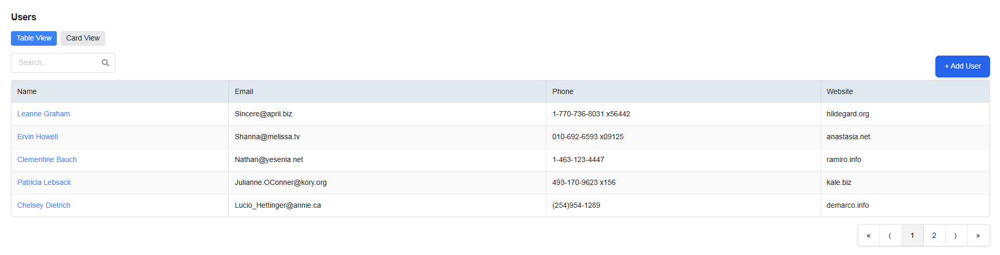
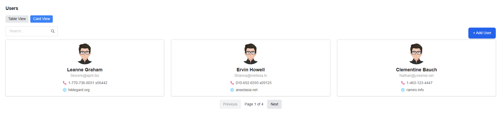
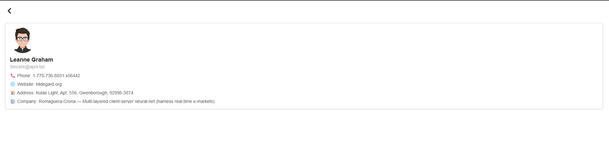
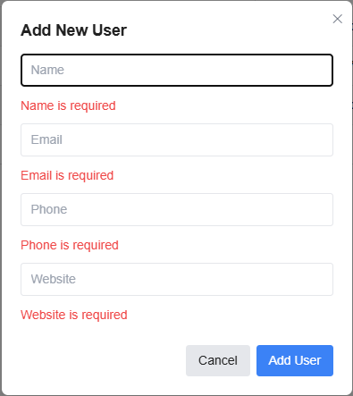

User Management App

A simple, responsive User Management Application built with Next.js, Semantic UI React, and Tanstack Query.
The app allows users to view, search, and manage user data from JSONPlaceholder API.

🚀 Live Demo
👉 [View Live on Vercel](https://user-management-five-taupe.vercel.app/)

📌 Objective

The goal of this project is to build a User Management App with the ability to:

Fetch and display a list of users

Switch between Table and Card views

Search and filter users

View detailed user profiles

Add new users via a form with validation

Provide a smooth, responsive UI

✨ Features

1. User List Page

✅ Fetch and display users using Tanstack Query from the API
✅ Toggle between Table view (Semantic UI Table) and Card view (Semantic UI Card)
✅ Persist selected layout in localStorage
✅ Search bar to filter users by name or email
✅ Show loading spinner while fetching data
✅ Show success/error messages on fetch

2. User Detail Page

✅ Click on a user to navigate to their detail page
✅ Display user info: Name, Email, Phone, Website, Address, Company
✅ Data fetching with Tanstack Query
✅ Back button to return to list page

3. User Management

✅ Add User Modal using Semantic UI React
✅ React Hook Form for managing form state
✅ Yup for validation schema
✅ Show toast notifications on successful/error submission

4. Deployment

✅ Deployed on Vercel for free hosting

🏆 Bonus Features

✅ TypeScript support

✅ Pagination for better data handling

✅ Reusable code & clean folder structure

🛠️ Tech Stack

Next.js – React framework (App Router)

Semantic UI React – UI components

TanStack Query (React Query) – Data fetching & caching

React Hook Form – Form state management

Yup – Schema validation

Axios – HTTP requests

TailwindCSS – Utility-first styling (for toast and custom styles)

📂 Project Structure
user-management/
├── app/
│ ├── users/ # User List + Detail pages
├── lib/ # API services
│── components/ # Reusable UI components
│── types/ # TypeScript types
|-....

⚡ Getting Started

1. Clone the Repository
   git clone https://github.com/your-username/user-management-app.git
   cd user-management

2. Install Dependencies
   pnpm install

3. Run Development Server
   pnpm dev

App will be running at http://localhost:3000

🚀 Deployment

The project is deployed on Vercel.
To deploy manually:

npm run build
vercel deploy

📸 Screenshots
User List – Table View

User List – Card View

User Detail Page

Add User Modal

📜 License
This project is licensed under the MIT License.
